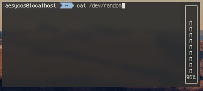

# Entropymon v0.0.1

Just a fun thing I wrote to show you about how much entropy your system has currently. The display updates about every quarter-second, giving you a percentage of your entropy generated.  
  
All information is gathered from `/proc/sys/kernel/random/entropy_avail`.  
  
  
  
## Dependencies
* ncurses [](https://opensource.org/licenses/MIT)  
* clang-8.0.1 License: UoI-NCSA  
* gcc-8.3.0 [](https://www.gnu.org/licenses/gpl-3.0)
[](https://www.gnu.org/licenses/lgpl-3.0)
[](https://www.gnu.org/licenses/fdl-1.3)  

## Install  
Just type the usual:  
```make```  
  
This will install the application `entropymon` to `/usr/local/bin`  
```make install```  
  
## License [](https://www.gnu.org/licenses/old-licenses/gpl-2.0.en.html)
This project is license under GPLv2  
  
(Not that I really know much about licensing so maybe it'll change)  
